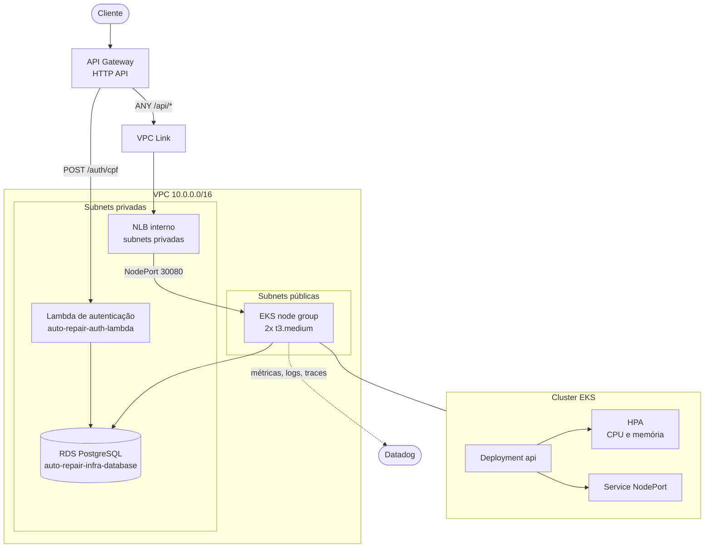

# auto-repair-infra-k8s

Infraestrutura de rede, cluster Kubernetes e borda de entrada do sistema de
gestão de oficina mecânica (Tech Challenge — Fase 3, FIAP postech).

Este é o **primeiro** dos quatro repositórios a ser aplicado: ele cria a VPC e
publica, via estado remoto, as saídas que os demais consomem.

## Propósito

| Componente | Função |
|---|---|
| VPC | Rede isolada, 2 AZs, subnets públicas (nós) e privadas (RDS, Lambda, NLB) |
| EKS | Cluster Kubernetes gerenciado, com node group e metrics-server para o HPA |
| ECR | Registro da imagem Docker da aplicação Rails |
| NLB interno | Balanceador que recebe o tráfego do API Gateway e entrega ao NodePort dos nós |
| API Gateway (HTTP API) | Borda pública: roteia `/auth/cpf` para a Lambda e `/api/*` para o cluster |
| VPC Link | Ponte entre o API Gateway e o NLB interno |
| IAM OIDC | Role assumida pelo GitHub Actions dos quatro repositórios, sem chave de longa duração |
| Datadog Agent | DaemonSet de métricas, logs e APM (opcional, ativado por variável) |

## Arquitetura



## Tecnologias

Terraform 1.10+, AWS (VPC, EKS, ECR, ELBv2, API Gateway v2, IAM), Helm,
módulos `terraform-aws-modules/vpc` e `terraform-aws-modules/eks`.

## Pré-requisitos

1. Bucket de estado remoto criado — ver [`bootstrap/README.md`](bootstrap/README.md)
2. Perfil AWS configurado: `aws configure --profile auto-repair`
3. Terraform 1.10 ou superior

## Execução

```bash
make init
make plan
make up          # ~15-20 min: o control plane do EKS é o passo demorado
make kubeconfig  # configura o kubectl para o cluster
make outputs     # imprime as saídas consumidas pelos outros repositórios
```

Para destruir tudo:

```bash
make down
```

> **Custo.** Este repositório provisiona os recursos mais caros do projeto:
> control plane do EKS (US$ 0,10/h, sem free tier), nós EC2 e NLB. Rodando 24/7
> a conta fica em torno de US$ 136/mês. Provisione para testar ou gravar e
> rode `make down` em seguida. Há um AWS Budget com alerta em US$ 10.

## Ordem de aplicação entre os repositórios

```
bootstrap (manual)
   └─► auto-repair-infra-k8s        (este repositório — cria a VPC)
          └─► auto-repair-infra-database   (RDS, lê a VPC do estado remoto)
                 └─► auto-repair-auth-lambda  (Lambda, lê VPC e banco)
                        └─► auto-repair-api      (aplicação Rails no cluster)
```

## Saídas publicadas

`vpc_id`, `public_subnet_ids`, `private_subnet_ids`, `vpc_cidr`,
`cluster_name`, `cluster_endpoint`, `node_security_group_id`,
`ecr_repository_url`, `api_gateway_url`, `api_gateway_id`,
`github_actions_role_arn`, `api_node_port`.

Consumidas pelos demais repositórios via `terraform_remote_state`.

## CI/CD

`.github/workflows/terraform.yml`:

- **Pull request** → `fmt -check`, `init`, `validate`, `plan`
- **Push na `main`** → `apply` automático

A autenticação com a AWS usa **OIDC**: o workflow assume a role
`auto-repair-github-actions` por token de curta duração, sem access key
armazenada nos Secrets do GitHub.

> O **primeiro** apply precisa ser local, porque é ele quem cria a role que o
> CI assume. A partir daí o pipeline é autossuficiente.

## Variáveis

| Variável | Padrão | Descrição |
|---|---|---|
| `project` | `auto-repair` | Prefixo dos recursos |
| `region` | `us-east-1` | Região AWS |
| `vpc_cidr` | `10.0.0.0/16` | CIDR da VPC |
| `kubernetes_version` | `1.31` | Versão do EKS |
| `node_instance_type` | `t3.medium` | Tipo dos nós |
| `node_desired_size` / `node_max_size` | `2` / `4` | Tamanho do node group |
| `api_node_port` | `30080` | NodePort alvo do NLB |
| `datadog_api_key` | `""` | Vazio desativa o agente |

## Decisões

Registradas como ADRs em [`auto-repair-api/docs/adr`](https://github.com/IgorSantosXP/auto-repair-api/tree/main/docs/adr).
Em resumo:

- **Sem NAT Gateway.** Nós em subnets públicas com IP público; RDS e Lambda em
  subnets privadas sem saída para a internet. Economiza US$ 32/mês sem expor o
  banco.
- **NLB com alvos por instância, criado no Terraform** em vez de um Service
  `type=LoadBalancer`. Evita a dependência circular entre o cluster e o API
  Gateway, que precisa do ARN do listener.
- **Lock de estado nativo do S3** (`use_lockfile`), dispensando DynamoDB.

## API

A collection da API fica no repositório da aplicação:
[Swagger UI](https://github.com/IgorSantosXP/auto-repair-api#documentação-da-api).
